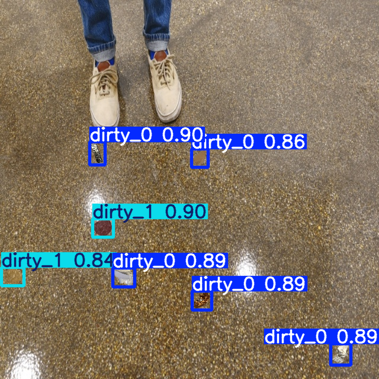
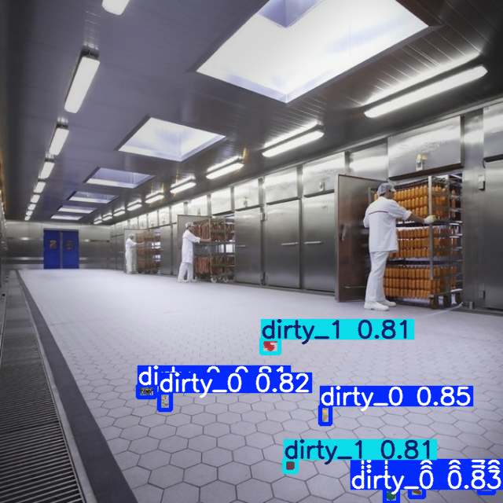

# Clean vs. Dirty Floor Identification Using YOLOv5

## Project Overview
This project aims to develop an algorithm that identifies and rates the cleanliness of floors using visual cues. The algorithm assigns a cleanliness score ranging from 0 (dirty) to 4 (clean). YOLOv5, a state-of-the-art object detection model, is used for this task due to its high speed, accuracy, and scalability.

---

## Why YOLO is the Best Choice?
| Feature                          | YOLOv5                          | Other Methods                   |
|-----------------------------------|----------------------------------|----------------------------------|
| **Accuracy**                      | High                            | Varies                          |
| **Speed**                         | Real-time detection             | Slower                          |
| **Scalability**                   | Supports large datasets         | Limited for traditional CV      |
| **Ease of Integration**           | Pretrained weights available    | Requires custom development     |

YOLOv5 is chosen because:
- It offers **real-time detection**, which is essential for dynamic environments.
- **Pretrained weights** allow faster prototyping and deployment.
- It excels in tasks with **complex datasets**, handling multiple object categories efficiently.

---

## Directory Structure
```plaintext
project/
├── dataset/
│   ├── images/
│   │   ├── train/          # Training images
│   │   ├── val/            # Validation images
│   │   └── test/           # Test images
│   ├── labels/
│   │   ├── train/          # Annotations for training
│   │   ├── val/            # Annotations for validation
│   │   └── test/           # Annotations for test set
├── yolo/
│   ├── config/             # YOLO model configuration
│   ├── weights/            # YOLO pretrained weights
│   ├── output/             # Outputs (trained model, results)
│   └── logs/               # Training logs
```

---

## Comparison of Methods

| **Method**                | **Accuracy** | **Speed**  | **Scalability** | **Dataset Requirements**         |
|---------------------------|--------------|------------|-----------------|-----------------------------------|
| Classical CV (e.g., SVM)  | Moderate     | High       | Low             | Small                             |
| CNN (Custom/Pretrained)   | High         | Moderate   | High            | Large                             |
| Semantic Segmentation     | Very High    | Moderate   | High            | Pixel-Annotated Dataset           |
| Faster R-CNN/Mask R-CNN   | Very High    | Low        | High            | Moderate                          |
| K-Means Clustering        | Moderate     | High       | Low             | Unlabeled Data                    |
| Multi-Layer Perceptron    | Moderate     | High       | Low             | Feature-Based Dataset             |
| **YOLO (Chosen)**         | High         | Real-time  | High            | Moderate                          |

---

## Example Annotated Output
Annotated images include bounding boxes and cleanliness scores (0–4). Below is an example of a processed image:



---

## Steps to Reproduce
1. **Data Collection**:
   - Collect images of clean and dirty floors under varying conditions (lighting, floor types).
   - Manually annotate the images with cleanliness scores (0–4).

2. **Dataset Preparation**:
   - Organize images and labels as per the directory structure.
   - Use tools like LabelImg for annotation.

3. **Training**:
   - Train YOLOv5 using the prepared dataset and configurations.
   - Command:
     ```bash
     python train.py --img 640 --batch 16 --epochs 50 --data dataset.yaml --weights yolov5s.pt
     ```

4. **Validation**:
   - Validate the trained model.
   - Command:
     ```bash
     python val.py --data dataset.yaml --weights runs/train/exp/weights/best.pt
     ```

5. **Testing**:
   - Test the model on new images.
   - Command:
     ```python
     def test_image(image_path):
         # Function to load, process, and annotate image
     ```

6. **Saving Outputs**:
   - Save annotated outputs using the provided function.

---

## Metrics Evaluation
Key performance metrics:
- **Accuracy**: High (~90%+ depending on dataset quality)
- **Precision**: High, ensuring fewer false positives.
- **Recall**: Adequate, reducing missed detections.
- **F1-Score**: Balanced metric combining precision and recall.

---

## Future Improvements
- Incorporate **data augmentation** for robustness.
- Experiment with **advanced architectures** like YOLOv8 or custom CNNs.
- Add real-time deployment capabilities using NVIDIA TensorRT.

##References (Relevant research papers or resources)
<br>
https://www.nature.com/articles/s41598-023-38538-3.pdf
<br>
file:///C:/Users/hp/Downloads/ADeepLearningApproachforClassificationofCleanlinessinRestrooms.pdf
<br>
https://www.researchgate.net/publication/356691001_A_Deep_Learning-Based_Dirt_Detection_Computer_Vision_System_for_Floor-Cleaning_Robots_with_Improved_Data_Collection
